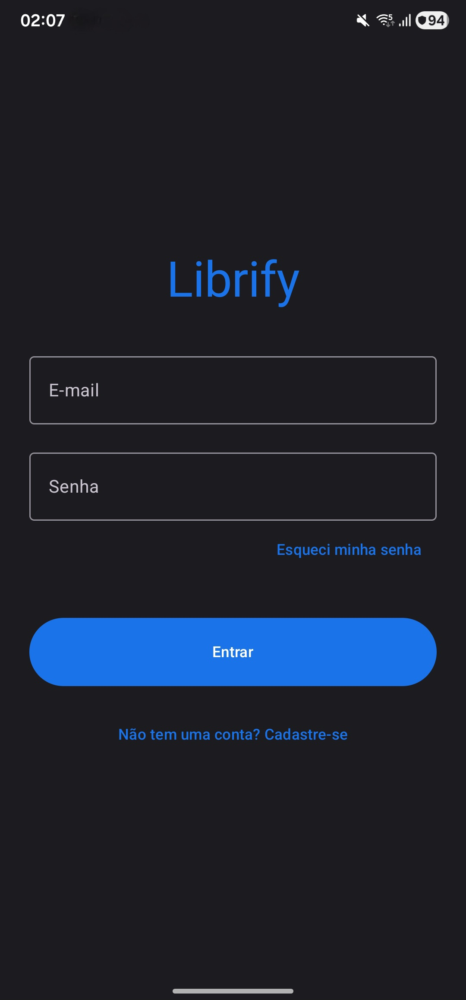
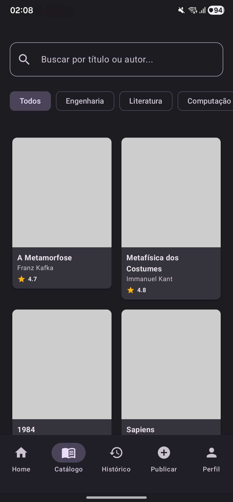
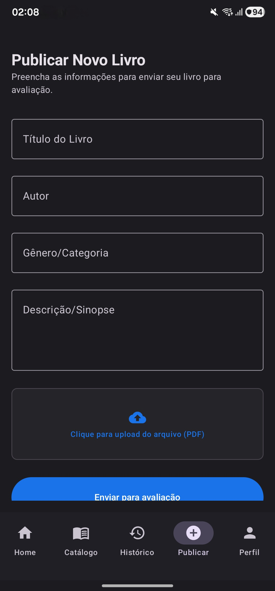

# Librify Mobile 📱📖

<p align="center">
  <br>
  <br>
  
  
  
  " alt="UNIFOR">
</p>

O **Librify Mobile** é um aplicativo Android nativo de biblioteca virtual acadêmica, projetado para modernizar a experiência de leitura e gestão de obras na comunidade universitária. O app permite automatizar o processo de reservas de livros, consulta de acervo em tempo real e a publicação colaborativa de obras acadêmicas por parte dos alunos.

> 🎓 **Projeto de Extensão Universitária** > Este software foi desenvolvido como parte das atividades de extensão da **Universidade de Fortaleza (UNIFOR)**, integrando conceitos práticos de Engenharia de Software, Arquitetura de Sistemas e Desenvolvimento Mobile Nativo.

---

## 📱 Interface do Aplicativo

<p align="center">
  
  
  
</p>
<p align="center">
  
  
  
</p>

---

## Contexto Acadêmico

| Parâmetro | Detalhes |
| :--- | :--- |
| **Instituição** | Universidade de Fortaleza (UNIFOR) |
| **Curso** | Ciência da Computação |
| **Disciplina** | Requisitos e Modelagem de Sistemas |
| **Orientador** | Dr. Pedro Pinheiro |

---

## Funcionalidades Implementadas (Mapeamento de Escopo)

O sistema foi totalmente modelado via UML e implementado com base nos requisitos funcionais adaptados para a experiência mobile nativa e reativa:

* **Autenticação Mobile (RF01 - RF03):** Login, Cadastro e Recuperação de Senha com persistência de estado e segurança de navegação (limpeza de pilha no logout).
* **Home e Destaque (RF05 - RF06):** Interface intuitiva com banner dinâmico do "Livro do Mês" (*A Metamorfose*) e carrosséis de recomendação personalizados.
* **Catálogo e Busca (RF07):** Pesquisa reativa por título ou autor com filtragem instantânea via *Chips* de categorias acadêmicas e arquitetura baseada em StateFlows.
* **Detalhes e Reservas (RF08):** Tela de especificações completa com fluxos de reserva imediata parametrizada por ID e adição à lista de leitura.
* **Avaliação Colaborativa (RF09):** Sistema de feedback com notas de 1 a 5 estrelas e listagem dinâmica de comentários de outros leitores.
* **Histórico e Prazos (RF10 - RF11):** Painel de controle estruturado com abas superiores (`TabRow`) para o usuário monitorar empréstimos ativos, reservas pendentes e prazos de devolução.
* **Publicação Acadêmica (RF12 - RF13):** Formulário de envio de obras com simulação visual de upload de PDF e acompanhamento de status por badges de cores semânticas.
* **Assistente Virtual (RF14):** Chat interativo integrado para suporte ao usuário com respostas simuladas automáticas via ViewModel.
* **Painel Administrativo:** Interface restrita para moderadores realizarem a aprovação ou rejeição de publicações diretamente no app, alterando o estado global em tempo real através do padrão Repository.

---

## Engenharia de Software & Stack Tecnológico

Para garantir performance, fluidez e uma arquitetura escalável padrão de mercado (*Enterprise Level*), utilizamos o ecossistema moderno recomendado pela Google:

* **Linguagem:** [Kotlin](https://kotlinlang.org/) (Corrotinas e Flow para gerenciamento reativo e assíncrono).
* **UI Framework:** [Jetpack Compose](https://developer.android.com/jetpack/compose) (Desenvolvimento de interfaces 100% declarativo).
* **Design System:** [Material Design 3](https://m3.material.io/) (Componentização moderna e paleta baseada na identidade visual da UNIFOR).
* **Arquitetura:** **MVVM** (Model-View-ViewModel) garantindo desacoplamento lógico e alta testabilidade.
* **Gerenciamento de Dados:** **Repository Pattern** com implementação *Singleton* atuando como a fonte única da verdade para a sincronização de estados entre as telas.
* **Navegação:** `Navigation Compose` lidando com rotas parametrizadas seguras e transições de tela limpas.

---

## Como Executar o Projeto

1.  **Pré-requisitos:** Certifique-se de ter o **Android Studio (Versão Ladybug ou superior)** instalado e configurado com o **JDK 17**.
2.  **Clonar o Repositório:**
    ```bash
    git clone [https://github.com/seu-usuario/librify-mobile.git](https://github.com/seu-usuario/librify-mobile.git)
    ```
3.  **Sincronizar:** Abra o projeto no Android Studio e aguarde a indexação do Gradle baixar todas as dependências (`navigation-compose`, `material-icons-extended`, etc.).
4.  **Configurar Dispositivo:** Recomenda-se rodar o app em um emulador ou dispositivo físico configurado com a **API 33 (Android 13)** ou superior.
5.  **Executar:** Clique no botão **Run 'app'** (ícone de Play verde) na barra superior. *O acesso é livre com qualquer formato de credencial devido à simulação de dados reativa na memória.*

---
<p align="center">
  <br>
  <i>Librify Mobile - Desenvolvido para transformar o ecossistema de leitura acadêmica da UNIFOR.</i>
</p>
